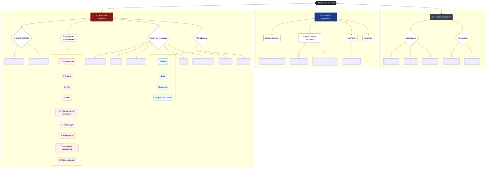

- 12.12.2025 ДАТА НАЧАЛА ПЕРЕМЕН
- 1. Полная миграция данных из рп Obsidian Quartz
- 2. Анализ и полировка полученной информации
- 3. Перепись канонов:
	- 3.1 Приоритет: Изначальный мир, Лунный континент, Государства (В порядке убывания приоритета: Технократия, Альянс, Тау, Нова, Поднебесный Синдикат, Геохроноум, Инфириум, Академия механистов, Черный рынок), Внешняя политика, Экология, Культура народов, Этнос, Значимые персонажи/Личности, Технологии, Феномены, Конкретно КАРМА, Душа, Сущность, Астральное тело
	- 3.2 Средний приоритет: Законы физики касательно (остальных), полимерных энергий, Хронологическая история развития РП, История и культура Древних, Биология, Виды и Расы, Культизм
	- 3.3 Наименьший приоритет: Межмирие, Кошмар, Искажение, Артефакты, Минералы и т.д.
- 4. Оформление вики через Quartz с маркдауном Obsidian
- 5. Процесс переписи правил проведения РП, анкет, переделка RainБота для работы с вики "Библиотека Лапласа"
- 6. Принятие критики и резолюция
- 7. Открытие РП для всех.

```mermaid
graph TD
    %% --- Стили ---
    classDef root fill:#212121,stroke:#fff,stroke-width:4px,color:#fff,font-size:20px;
    classDef high fill:#7f1d1d,stroke:#fca5a5,stroke-width:2px,color:#fff;
    classDef med fill:#1e3a8a,stroke:#93c5fd,stroke-width:2px,color:#fff;
    classDef low fill:#374151,stroke:#d1d5db,stroke-width:2px,color:#fff;
    
    classDef subItem fill:#fff,stroke:#333,color:#000;
    classDef stateNode fill:#fff0f0,stroke:#b91c1c,color:#000,stroke-dasharray: 5 5;
    classDef metaNode fill:#f0f9ff,stroke:#0369a1,color:#000;

    %% --- Корневой узел ---
    ROOT([📜 Перепись Канонов]):::root

    %% --- Ветви приоритетов ---
    ROOT --> P1(3.1 Высокий приоритет):::high
    ROOT --> P2(3.2 Средний приоритет):::med
    ROOT --> P3(3.3 Низкий приоритет):::low

    %% --- 3.1 ВЫСОКИЙ ПРИОРИТЕТ ---
    subgraph HIGH_LEVEL [ ]
        direction TB
        
        %% География и Мир
        P1 --> WORLD{Мироустройство}:::subItem
        WORLD --> W1(Изначальный мир)
        WORLD --> W2(Лунный континент)

        %% Государства (Цепочка приоритета)
        P1 --> STATES_GROUP{{Государства<br/>по убыванию}}:::subItem
        
        subgraph STATE_CHAIN [Цепочка Государств]
            direction TB
            S1(1. Технократия):::stateNode --> S2(2. Альянс):::stateNode
            S2 --> S3(3. Тау):::stateNode
            S3 --> S4(4. Нова):::stateNode
            S4 --> S5(5. Поднебесный Синдикат):::stateNode
            S5 --> S6(6. Геохроноум):::stateNode
            S6 --> S7(7. Инфириум):::stateNode
            S7 --> S8(8. Академия механистов):::stateNode
            S8 --> S9(9. Черный рынок):::stateNode
        end
        STATES_GROUP -.-> S1

        %% Социум и Политика
        P1 --> SOCIETY{Социум и Культура}:::subItem
        SOCIETY --> SOC1(Внешняя политика)
        SOCIETY --> SOC2(Экология)
        SOCIETY --> SOC3(Культура народов)
        SOCIETY --> SOC4(Этнос)
        SOCIETY --> SOC5(Значимые Личности)

        %% Метафизика и КАРМА
        P1 --> META{Метафизика}:::subItem
        META --> TECH(Технологии)
        META --> PHEN(Феномены)
        
        subgraph KARMA_CORE [Ядро: КАРМА]
            direction LR
            K1(КАРМА):::metaNode --- K2(Душа):::metaNode
            K2 --- K3(Сущность):::metaNode
            K3 --- K4(Астральное тело):::metaNode
        end
        META -.-> K1
    end

    %% --- 3.2 СРЕДНИЙ ПРИОРИТЕТ ---
    subgraph MED_LEVEL [ ]
        direction TB
        P2 --> PHYSICS(Законы физики):::subItem
        PHYSICS --- PHYS_NOTE[Полимерные энергии]
        
        P2 --> HIST(Хронология и История):::subItem
        HIST --> H1[Развитие РП]
        HIST --> H2[История и культура Древних]
        
        P2 --> BIO(Биология):::subItem
        BIO --> B1[Виды и Расы]
        
        P2 --> CULT(Культизм):::subItem
    end

    %% --- 3.3 НИЗКИЙ ПРИОРИТЕТ ---
    subgraph LOW_LEVEL [ ]
        direction TB
        P3 --> ABSTRACT{Абстракция}:::subItem
        ABSTRACT --> A1[Межмирие]
        ABSTRACT --> A2[Кошмар]
        ABSTRACT --> A3[Искажение]
        
        P3 --> ITEMS{Предметы}:::subItem
        ITEMS --> I1[Артефакты]
        ITEMS --> I2[Минералы]
    end

    %% Линковка подграфов (скрытая, для выравнивания)
    STATES_GROUP ~~~ KARMA_CORE
```
